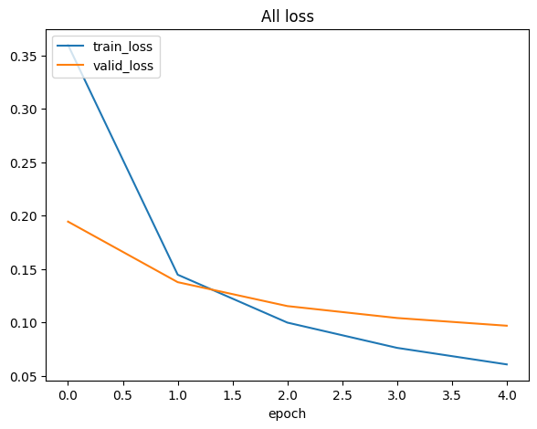
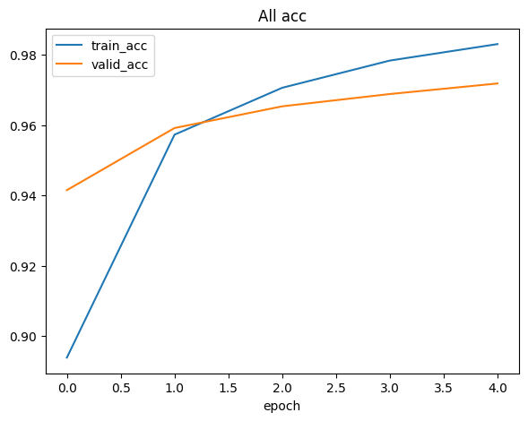
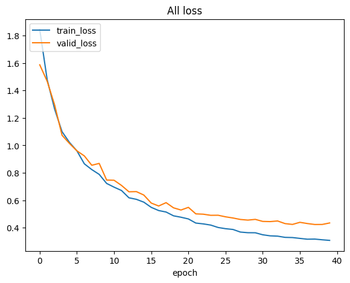
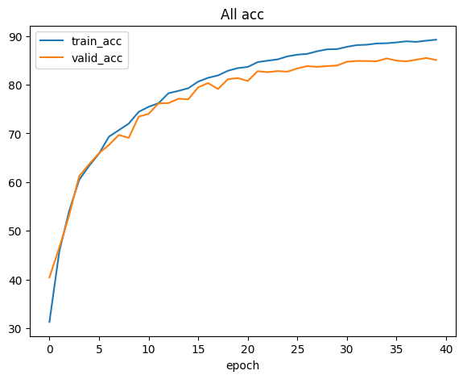

# 🧾 作業報告：從手刻模型到 PyTorch ResNet18

---

## 一、實作方式說明

### （一）手刻模型（Numpy-based MLP）

本次作業首先以 **純 Python + NumPy** 的方式手刻一個多層感知機（MLP），以深入理解深度學習模型的數學運作過程。整體架構由以下幾個模組組成：

1. **Module 基底類別**
   所有層（如 Linear、ReLU、Sigmoid、Softmax）皆繼承自 `Module` 類別，統一實作 `forward()`、`backward()`、`parameters()` 三個介面。
   並透過 `__call__()` 封裝 forward，使得模型可用 PyTorch 風格呼叫：

   ```python
   out = model(x)
   ```

2. **Linear 層**
   使用矩陣運算實現：
   $$
   y = xW + b
   $$
   在 backward 階段依據鏈式法則推導梯度：
   $$
   dW = x^T \cdot dy, \quad dx = dy \cdot W^T
   $$
   權重初始化為小隨機值（乘上 0.01），以避免初期梯度爆炸。

3. **ReLU、Sigmoid、Softmax 激活函式**

   * **ReLU**：輸出 $$ \max(0, x) $$
   * **Sigmoid**：輸出 $$ \frac{1}{1 + e^{-x}} $$
   * **Softmax**：將每筆輸入轉換為機率分佈（僅實作 forward，backward 由 CrossEntropyLoss 處理）

4. **CrossEntropyLoss 損失函式**
   採用負對數似然公式，計算分類問題的損失值，並可回傳輸出對 logits 的梯度（供 backward 使用）。

5. **SGD 優化器**
   採用簡單的隨機梯度下降演算法：
   $$
   \theta = \theta - \eta \cdot \nabla_\theta L
   $$
   並在每個 batch 結束後清空梯度。

6. **訓練與評估流程**

   * `train_one_epoch()`：執行 forward、loss 計算、backward、參數更新。
   * `evaluate()`：僅進行前向傳播與準確率、loss 統計，不進行梯度更新。

> ✅ 透過這個階段的實作，我深入理解了反向傳播（Backpropagation）的數學原理，並能手動追蹤梯度在各層的流動過程。

---

### （二）PyTorch ResNet18 模型

接著，我使用 **PyTorch** 框架實作並訓練 ResNet-18 模型，以體驗高階深度學習工具的模組化設計與加速能力。

1. **模型建立**
   使用 `torchvision.models.resnet18(pretrained=False)` 建立基本架構，並依據資料集類別數修改最後的輸出層：

   ```python
   model.fc = nn.Linear(model.fc.in_features, num_classes)
   ```

2. **訓練配置**

   * 損失函式：`nn.CrossEntropyLoss()`
   * 優化器：`torch.optim.SGD(model.parameters(), lr=0.01, momentum=0.9)`
   * 加速裝置：使用 GPU (`cuda`) 執行 forward/backward 運算

3. **訓練流程**
   在每個 epoch 中執行：

   ```python
   optimizer.zero_grad()
   out = model(x)
   loss = criterion(out, y)
   loss.backward()
   optimizer.step()
   ```

   並於驗證階段使用 `with torch.no_grad()` 關閉梯度計算以節省記憶體。

> ✅ 這個部分展現出 PyTorch 對模型訓練流程的封裝優勢，使我能專注於網路結構與參數調整，而非梯度推導。

---

## 二、訓練結果
### Task 1


### Task 2



例如：

* 圖 1：Training vs Validation Loss (Across Epochs)
* 圖 2：Training vs Validation Accuracy (Across Epochs)

---

## 三、問題與解決方法

| 問題                                | 原因分析                    | 解決方法                                                     |
| --------------------------------- | ----------------------- | -------------------------------------------------------- |
| **1. backward 鏈式法則錯誤**            | Linear 層梯度公式維度推導錯誤      | 重新推導並驗證公式：`dW = x.T @ dy`、`dx = dy @ W.T`                |
| **2. Softmax overflow**           | 輸入過大造成 `exp()` overflow | 實作中先減去最大值：`np.exp(x - np.max(x, axis=1, keepdims=True))` |
| **3. 學習不收斂**                      | 學習率過大                   | 將學習率降至 0.01，並初始化權重為小值                                    |
| **4. Dataset split 偏差**           | 未打亂資料導致分佈不均             | 使用 `np.random.permutation()` 打亂索引後再切分                    |
| **5. PyTorch tensor / numpy 不相容** | 資料型態或裝置不一致              | 使用 `.to(device)` 或 `.numpy()` 轉換確保一致                     |
| **6. ResNet 記憶體不足**               | CPU batch 過大導致溢出        | 使用 GPU 訓練、減少 batch size、或於測試時加入 `torch.no_grad()`        |

---

## 四、結論與心得

本次作業讓我同時從「底層實作」與「高階框架」兩個層面理解深度學習模型的運作。

* **手刻模型**：幫助我釐清反向傳播的數學邏輯，理解每一層如何傳遞梯度。
* **PyTorch 模型**：讓我學會快速構建與訓練複雜網路，體驗框架的便利性與高效性。

透過這兩種方式的對照，我更加理解深度學習從理論到實務的連貫性，也能更有效地分析模型行為與訓練問題。


