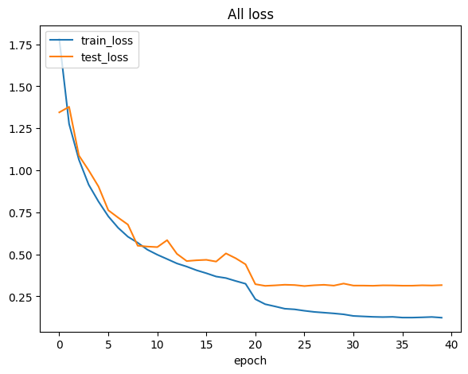
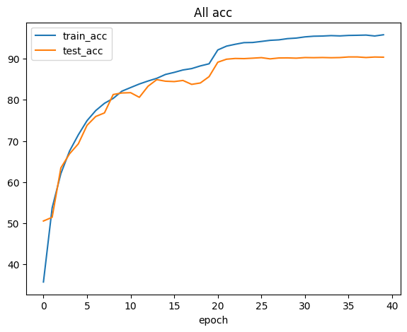
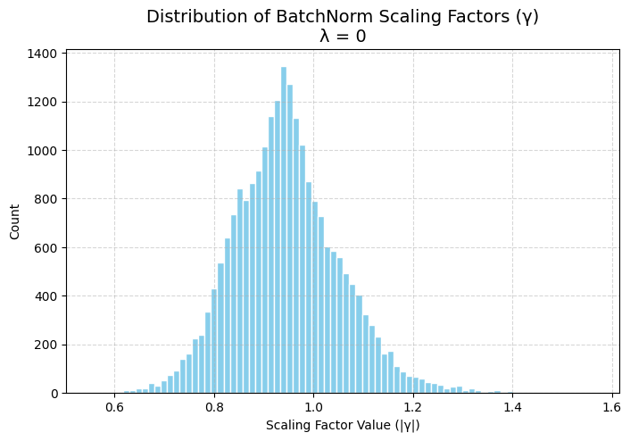
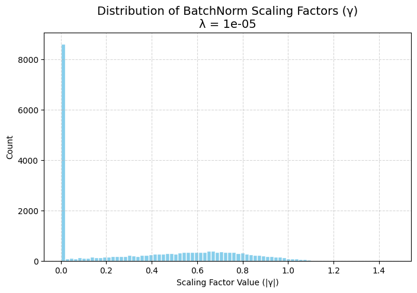
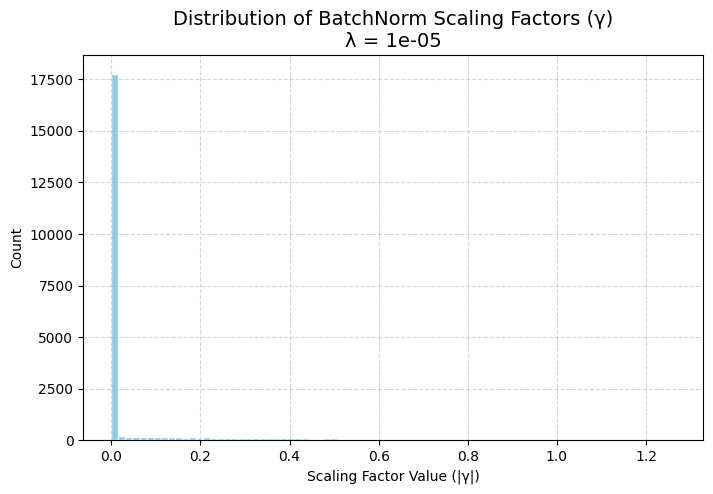
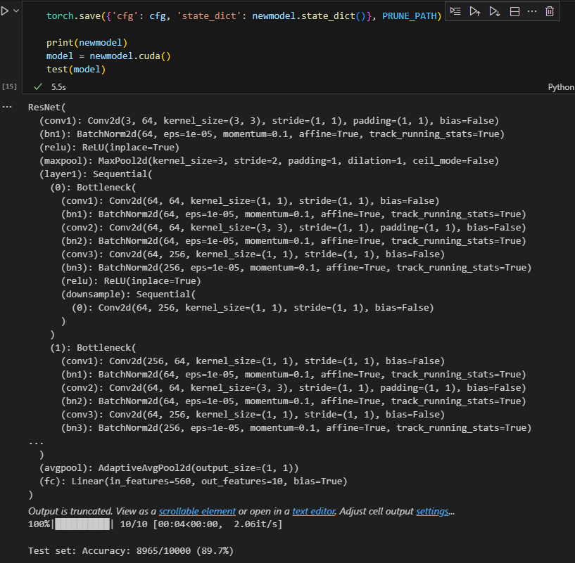
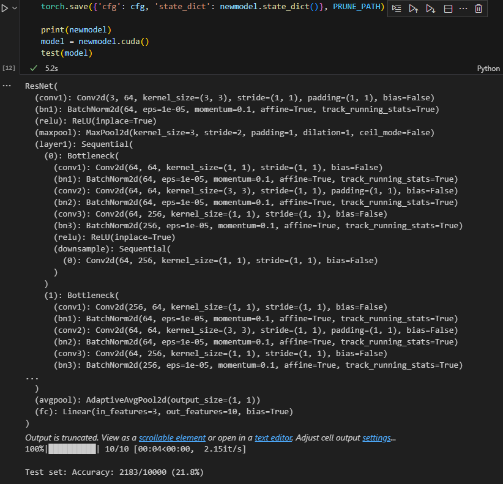
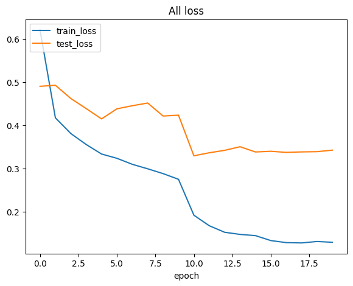
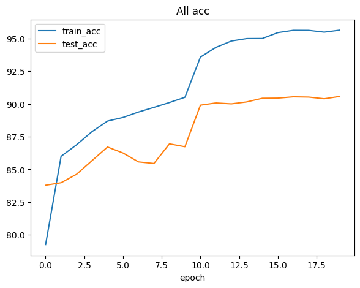

# Plots
## Train and test accuracy in sparsity-training


## Scaling factor distribution with 3 different λ value



## Test accuracy after pruning 50% and 90% channels
### 50% pruned
```
FLOPs: 214728384.0
Params: 9563795.0

......

================================================================
Total params: 9,563,795
Trainable params: 9,563,795
Non-trainable params: 0
----------------------------------------------------------------
Input size (MB): 0.01
Forward/backward pass size (MB): 21.51
Params size (MB): 36.48
Estimated Total Size (MB): 58.01
----------------------------------------------------------------
```



### 90% pruned
```
FLOPs: 130298030.0
Params: 3736356.0

......

================================================================
Total params: 3,736,356
Trainable params: 3,736,356
Non-trainable params: 0
----------------------------------------------------------------
Input size (MB): 0.01
Forward/backward pass size (MB): 20.15
Params size (MB): 14.25
Estimated Total Size (MB): 34.41
```


## Train and test accuracy after fine-tuning the pruned 90% model


# Discussion
## Show and compare the test accuracy and model parameters among the original and fine-tuned models
### Original model
```
FLOPs: 328947712.0
Params: 23513162.0

......

================================================================
Total params: 23,513,162
Trainable params: 23,513,162
Non-trainable params: 0
----------------------------------------------------------------
Input size (MB): 0.01
Forward/backward pass size (MB): 22.47
Params size (MB): 89.70
Estimated Total Size (MB): 112.18
----------------------------------------------------------------
```


Best test acc: 90.4%
### Fine-tuned model
```
FLOPs: 130298030.0
Params: 3736356.0

......

================================================================
Total params: 3,736,356
Trainable params: 3,736,356
Non-trainable params: 0
----------------------------------------------------------------
Input size (MB): 0.01
Forward/backward pass size (MB): 20.15
Params size (MB): 14.25
Estimated Total Size (MB): 34.41
```


Best test acc: 90.6%

### Comparison
The total params reduce by 84.11%, and the estimated total size reduces by 69.32%, while the accuracies remain almost the same. 

Besides the numbers of parameters, the accuracies are almost the same, meaning that the fine-tuned pruned model is effectively exploiting all the channels left after being pruned. 

## Explain how you modified resnet.py
```python
self.conv1 = nn.Conv2d(in_channels, out_channels[0], kernel_size=1, stride=1, padding=0, bias=False)
self.bn1 = nn.BatchNorm2d(out_channels[0])

self.conv2 = nn.Conv2d(out_channels[0], out_channels[1], kernel_size=3, stride=stride, padding=1, bias=False)
self.bn2 = nn.BatchNorm2d(out_channels[1])
self.conv3 = nn.Conv2d(out_channels[1], planes * self.expansion, kernel_size=1, stride=1, padding=0, bias=False)
self.bn3 = nn.BatchNorm2d(planes * self.expansion)
self.relu = nn.ReLU(inplace=True)
self.downsample = downsample

# .......

downsample = None

first_block_cfg = cfg[self.current_cfg_idx : self.current_cfg_idx + 3]
in_channels = self.inplanes
out_channels = first_block_cfg[2]

# if stride != 1, do downsample
if stride != 1 or in_channels != out_channels:
    out_channels = planes * 4
    downsample = nn.Sequential(
        nn.Conv2d(
            in_channels,
            out_channels,
            kernel_size=1,
            stride=stride,
            bias=False,
        ),
        # nn.BatchNorm2d(out_channels),
    )

layers = []
# first block（might need downsample）
layers.append(
    block(in_channels, planes, first_block_cfg, downsample=downsample, stride=stride)
)

# update channels and cfg index
self.inplanes = out_channels
self.current_cfg_idx += 3

# rest of blocks（stride=1, downsample=None）
for i in range(1, blocks):
    block_cfg = cfg[self.current_cfg_idx : self.current_cfg_idx + 3]
    layers.append(
        block(self.inplanes, planes, block_cfg, downsample=None, stride=1)
    )
    self.inplanes = block_cfg[2]
    self.current_cfg_idx += 3

return nn.Sequential(*layers)
```

In the Bottleneck block, the input and output channel configuration follows the `cfg` passed in. Specifically, `out_channels[]` is derived from` cfg[]` to determine the number of output channels for each convolution layer.
Moreover, to ensure compatibility with the pruning process, the channel numbers of layers involved in identity shortcuts must remain fixed. Therefore, the value of `out_channels[2]` is replaced with a fixed number, defined as `planes * self.expansion`.

In the `make_layer` function, the key point is to correctly utilize the channel numbers defined in `cfg[]` when constructing each block. Since each layer contains multiple blocks, the way the index is iterated becomes crucial to ensure the correct mapping of channel configurations.

## Explain how you copied the original model weights to the pruned model.
```python
for layer_id in range(len(old_modules)):

    m0 = old_modules[layer_id]
    m1 = new_modules[layer_id + layer_id_offset]

    if type(m0) != type(m1):
        layer_id_offset += 2
        m1 = new_modules[layer_id + layer_id_offset]

    if isinstance(m0, nn.BatchNorm2d):
        bn_count += 1
        
        #### 找出遮罩中非零元素的index ####
        idx1 = np.squeeze(np.argwhere(np.asarray(end_mask.cpu().numpy())))
        if idx1.ndim == 0:
            idx1 = np.expand_dims(idx1, 0)


        #### 複製weight, bias, running mean,and running variance #### 
        if cfg_origin[layer_id_in_cfg] > cfg_origin[layer_id_in_cfg - 1]: # change to origin cfg value
            new_w = torch.zeros_like(m0.weight.data)  # 先建立同 shape 的 0 tensor
            new_b = torch.zeros_like(m0.bias.data)  # 先建立同 shape 的 0 tensor
            new_rm = torch.zeros_like(m0.running_mean)  # 先建立同 shape 的 0 tensor
            new_rv = torch.zeros_like(m0.running_var)  # 先建立同 shape 的 0 tensor
            new_w[idx1] = m0.weight.data[idx1].clone()
            new_b[idx1] = m0.bias.data[idx1].clone()
            new_rm[idx1] = m0.running_mean[idx1].clone()
            new_rv[idx1] = m0.running_var[idx1].clone()
            m1.weight.data = new_w.clone()
            m1.bias.data = new_b.clone()
            m1.running_mean = new_rm.clone()
            m1.running_var = new_rv.clone()
        else:
            m1.weight.data = m0.weight.data[idx1].clone()
            m1.bias.data = m0.bias.data[idx1].clone()
            m1.running_mean = m0.running_mean[idx1].clone()
            m1.running_var = m0.running_var[idx1].clone()

        layer_id_in_cfg += 1
        start_mask = end_mask.clone()

        #最後一層連接層不做修改
        if layer_id_in_cfg < len(cfg_mask):
            end_mask = cfg_mask[layer_id_in_cfg]


    elif isinstance(m0, nn.Conv2d):
        w = m0.weight.data.clone()
        # Conv2d weight shape: [out_channels, in_channels, kH, kW]

        # 判斷是否為 downsample conv
        is_downsample = (
            m0.kernel_size == (1, 1)
            and (m0.stride != (1, 1))
        )

        if isinstance(old_modules[layer_id + 1], nn.BatchNorm2d):

            # 一般 conv，會被剪 input/output channel
            idx0 = np.squeeze(np.argwhere(np.asarray(start_mask.cpu().numpy())))
            idx1 = np.squeeze(np.argwhere(np.asarray(end_mask.cpu().numpy())))

            if cfg_origin[layer_id_in_cfg] > cfg_origin[layer_id_in_cfg - 1]: # change to origin cfg value
                new_w = torch.zeros_like(m0.weight.data)  # 先建立同 shape 的 0 tensor
                new_w[idx1.tolist(), :, :, :] = w[idx1.tolist(), :, :, :].clone()
                new_w = new_w[:, idx0.tolist(), :, :].clone()
                m1.weight.data = new_w.clone()
            elif cfg_origin[layer_id_in_cfg] < cfg_origin[layer_id_in_cfg - 1]:
                new_w = torch.zeros_like(m0.weight.data)  # 先建立同 shape 的 0 tensor
                new_w = w[idx1.tolist(), :, :, :].clone()
                new_w[ :,idx0.tolist() , :, :] = new_w[:, idx0.tolist(), :, :].clone()
                m1.weight.data = new_w.clone()
            else:
                m1.weight.data = w[idx1.tolist(), :, :, :].clone()
                m1.weight.data = m1.weight.data[:, idx0.tolist(), :, :].clone()

        else:
            # 其他層 (例如第一層 conv)
            print("downsample:")
            m1.weight.data = w.clone()
            
    elif isinstance(m0, nn.Linear):

        idx0 = np.squeeze(np.argwhere(np.asarray(start_mask.cpu().numpy())))
        if idx0.ndim == 0:
            idx0 = np.expand_dims(idx0, 0)

        #### 複製weight ####
        m1.weight.data = torch.zeros_like(m0.weight.data)
        m1.weight.data[:, idx0.tolist()] = m0.weight.data[:, idx0.tolist()].clone()

        #### 複製bias ####
        m1.bias.data = m0.bias.data.clone()
```
### Overall goal

This code iterates through **pairs of layers** from:

* `old_modules`: the **original model** before pruning,
* `new_modules`: the **new model** created based on a pruned configuration (`cfg`).

The goal is to **copy weights** (and BatchNorm statistics) from the old model into the new one **only for the channels that were not pruned**, based on the masks (`cfg_mask`).


### Explanation

#### 1. Layer mapping and offset adjustment

```python
m0 = old_modules[layer_id]
m1 = new_modules[layer_id + layer_id_offset]

if type(m0) != type(m1):
    layer_id_offset += 2
    m1 = new_modules[layer_id + layer_id_offset]
```

* `m0`: old layer, `m1`: new (pruned) layer.
* If layer types don’t match (e.g., due to **extra downsample layers in Bottleneck**), `layer_id_offset` is adjusted.
* This ensures correct **layer alignment** between old and new models.

#### 2. BatchNorm2d layer weight copy

```python
if isinstance(m0, nn.BatchNorm2d):
    idx1 = np.squeeze(np.argwhere(np.asarray(end_mask.cpu().numpy())))
```

* `end_mask` is the pruning mask for the output channels of the *previous convolution*.
* `idx1` contains the indices of **channels kept after pruning**.

Then it handles two cases:

##### Case A — When shortcut channels must remain fixed:

```python
if cfg_origin[layer_id_in_cfg] > cfg_origin[layer_id_in_cfg - 1]:
```

* This happens when the current layer’s output channels are **larger than** the previous layer’s — meaning this BN layer belongs to a **residual shortcut connection** that must maintain its full width.
* In this case:

  * It creates **zero tensors** of the full (original) shape.
  * Copies BN parameters (`weight`, `bias`, `running_mean`, `running_var`) only for **non-zero masked channels**, leaving pruned channels as zero.
  * This ensures that **residual branches (identity connections)** that depend on full channel alignment are **not broken**.

##### Case B — Normal pruned BN

```python
else:
    m1.weight.data = m0.weight.data[idx1].clone()
    m1.bias.data = m0.bias.data[idx1].clone()
    m1.running_mean = m0.running_mean[idx1].clone()
    m1.running_var = m0.running_var[idx1].clone()
```

* For normal pruned BN layers, it simply copies the BN parameters for the kept indices (`idx1`).

#### 3. Conv2d layer weight copy

```python
if isinstance(m0, nn.Conv2d):
    w = m0.weight.data.clone()
```

The code handles **two kinds of convs**:

##### (a) Regular convolution (connected to a BN)

```python
idx0 = np.squeeze(np.argwhere(np.asarray(start_mask.cpu().numpy())))
idx1 = np.squeeze(np.argwhere(np.asarray(end_mask.cpu().numpy())))
```

* `idx0`: the indices of **input channels** to keep.
* `idx1`: the indices of **output channels** to keep.
* The pruning masks define which channels survive in both directions.

Then similar to BN, there are three possible configurations:

* **Expanding channels (e.g., in shortcut branch):**

  ```python
  if cfg_origin[layer_id_in_cfg] > cfg_origin[layer_id_in_cfg - 1]:
  ```

  → Creates a **zero-filled tensor** of original shape, then selectively copies surviving weights.

* **Reducing channels:**

  ```python
  elif cfg_origin[layer_id_in_cfg] < cfg_origin[layer_id_in_cfg - 1]:
  ```

  → Copies only surviving output and input channels.

* **Normal pruning:**

  ```python
  else:
      m1.weight.data = w[idx1.tolist(), :, :, :].clone()
      m1.weight.data = m1.weight.data[:, idx0.tolist(), :, :].clone()
  ```

  → Selects the subset of input/output channels specified by both masks.

This ensures **proper alignment** of convolutional filters after pruning.

##### (b) Downsample convolution (in the residual path)

```python
else:
    print("downsample:")
    m1.weight.data = w.clone()
```

* For 1×1 **downsample convs** (used in Bottleneck shortcuts), no pruning is applied.
* The weights are copied directly, preserving **channel alignment** in the residual path.

#### 4. Linear layer (final FC)

```python
elif isinstance(m0, nn.Linear):
    idx0 = np.squeeze(np.argwhere(np.asarray(start_mask.cpu().numpy())))
    m1.weight.data[:, idx0.tolist()] = m0.weight.data[:, idx0.tolist()].clone()
    m1.bias.data = m0.bias.data.clone()
```

* The FC layer’s input dimension is pruned according to the **final feature map mask**.
* Output neurons are not pruned, so only the input weights are selectively copied.

### How it prevents residual channel mismatches

Residual (shortcut) paths in ResNet require that:

```
output of main branch == output of identity branch
```

If you prune channels arbitrarily, these two branches won’t have matching dimensions, leading to runtime errors or incorrect summation.

This script prevents that by:

1. **Fixing the channels of residual-related layers**
   When `cfg_origin[layer_id_in_cfg] > cfg_origin[layer_id_in_cfg - 1]`,
   → those layers keep the full channel width (`planes * self.expansion`).
   → corresponding masks (`end_mask`) are forced to full-length, so both main and shortcut paths match.

2. **Zero-padding or masking-out unused weights instead of removing them**
   For residual layers, it keeps the original tensor shape but zeros out pruned channels.
   This ensures consistency in tensor shapes across skip connections.


## Please think about why it prompts you to fix the input and output channel numbers of each bottleneck to the channel numbers before pruning. What could happen if they are not fixed, and why?
### Background: how a Bottleneck works

A **Bottleneck block** in ResNet typically looks like this:

```
Input → [1×1 conv → BN → ReLU → 3×3 conv → BN → ReLU → 1×1 conv → BN] → Add(identity) → ReLU
```

* The **main path** (3 conv layers) transforms the input.
* The **shortcut (identity) path** passes the input through unchanged — unless the spatial or channel size changes, in which case a **downsample conv** aligns it.
* At the end, the two paths are added elementwise:

  ```
  output = main_branch_output + identity
  ```

For this addition to work, **the two tensors must have the exact same shape**
→ especially the **same number of channels**.


### What goes wrong if you prune freely

If you prune channels in each convolution **independently**, you’ll almost certainly break the equality between the shortcut and the main branch outputs.

#### Example:

Suppose a Bottleneck block originally had:

* Input channels = 256
* Output channels = 256

Now you prune:

| Layer              | Original channels | After pruning |
| ------------------ | ----------------- | ------------- |
| Conv1 (1×1 reduce) | 256→64            | 256→48        |
| Conv2 (3×3)        | 64→64             | 48→40         |
| Conv3 (1×1 expand) | 64→256            | 40→200        |

The main branch now outputs **200 channels**,
but the identity branch still has **256 channels**.

So when you reach:

```python
out = out + identity
```

you’ll get:

```
RuntimeError: The size of tensor a (200) must match the size of tensor b (256)
```

That’s the fundamental **shape mismatch problem**.


### Why fixing channel numbers solves it

To prevent this, the pruning procedure **fixes certain channel dimensions** inside Bottleneck blocks:

* The **input and output channels** of each block must stay **identical to the unpruned model** (e.g., 256 → 256).
* Only the **intermediate channels** (the inner 1×1 and 3×3 convs) are pruned.

In code terms, that’s why:

```python
out_channels[2] = planes * self.expansion
```

is fixed — `planes * expansion` equals the original output dimension.

This ensures:

```
main path output channels == shortcut path output channels
```

So even after pruning, the addition

```python
out += identity
```

is safe and consistent across all residual blocks.


### What happens internally if you *don’t* fix them

If you prune output channels arbitrarily, several issues appear:

1. **Runtime dimension mismatch**

   * The most immediate failure: tensors can’t be added in residual connections.

2. **Weight transfer inconsistency**

   * During weight copying (like in your script), masks won’t align properly.
   * The pruned model and original model have different channel indexing, so copying weights by mask will misalign filters.

3. **Downstream dependency breakage**

   * The output of one Bottleneck becomes the input of the next.
   * If output channels differ, the next block’s input BN and conv layers will no longer match.

In other words, one mismatch propagates forward and corrupts the network structure.


### Correct pruning rule for ResNet Bottleneck

* **Fix:**

  * Input channels = same as before pruning.
  * Output channels = `planes * expansion` (original width).
* **Allow pruning:**

  * Middle conv channels (the bottleneck width).

This preserves:

* Compatibility between residual and main branches.
* Consistency for weight transfer and forward shape inference.


## Describe the problems you encountered and how you solved them
At first, I didn’t realize that fixing the channel numbers of residual blocks was necessary to ensure the identity shortcuts would work properly.

1. Initially, I tried to solve the channel mismatch problem by adding an extra `conv1d` layer to align the channel numbers between the main and shortcut paths.
2. However, these additional layers in the pruned model caused mismatches when copying weights from the original model.
3. To handle this, I added an offset to the layer index of the new model whenever it encountered one of these extra layers, allowing all weights to be transferred.
4. Despite that, the pruned model performed terribly — the accuracy dropped to around 10%, which was equivalent to random guessing.
5. I then removed the extra `conv1d` layers to eliminate the artificial projection shortcuts and started focusing on making the **identity shortcuts** work even when channel numbers differed.
6. Eventually, I realized that layers involved in identity shortcuts must have **fixed channel numbers** in order to maintain consistency.
7. I modified the model structure so that these layers always kept their original channel numbers.
8. After that, I discovered that during weight copying, the pruned channel configurations were still overwriting the fixed channel settings of the shortcut layers.
9. To solve this, I changed the weight-copying method so that pruned channels were **zeroed out** instead of being removed.
10. With this adjustment, the model could finally be pruned and passed the inference test.
11. I then proceeded to the fine-tuning stage.
12. While loading the pruned model, I noticed that the `cfg[]` (which records the channel numbers) still contained pruned values for shortcut layers.
13. I updated `cfg[]` so that all shortcut layers had **fixed channel numbers**.
14. After this correction, the pruned model loaded successfully and fine-tuning worked as expected.
15. The final model achieved good accuracy while reducing the total number of parameters by **84%**.
