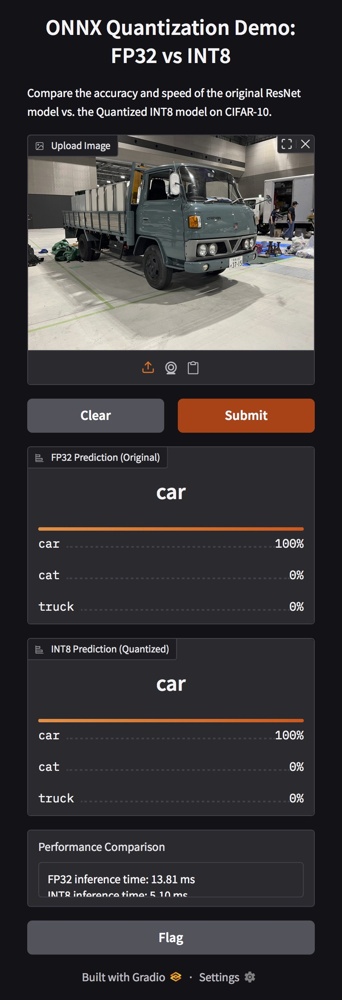
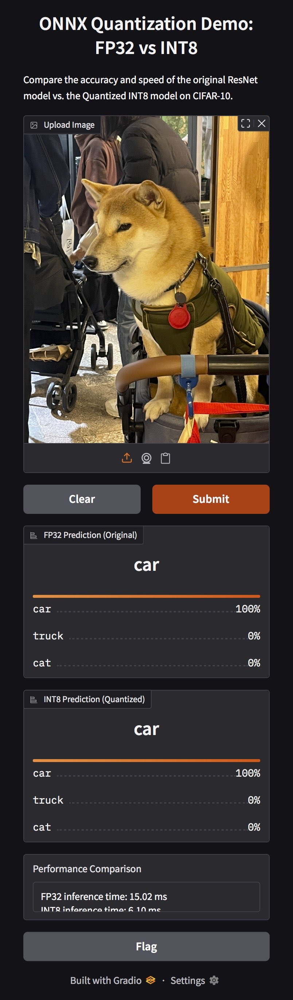

# Lab 5 Report
## Inference on Edge Device

## Difference Between FP32/INT8 Model
To be honest, I can see no difference in terms of accuracy since both models are wrong. However, in terms of inference time, we can tell that `INT8` ones are about twice to thrice as fast as the `FP32` ones. So there does have difference between two of them. 

Since the inference accuracies are not ideal, let's try to think about the reason why the accurary is not good. I come up to a few reasons.
1. My code is wrong:  
  It might just be possibile that my code is not totally correct even though while running the whole program, I got zero errors. It might be the problem of my way of approaching rather than the incorrect behaviar of code.

2. Weights provided by TA is not generic amoung everyone/every version of onnx, torch, etc. 

## Feedback and Suggestion
Working through this lab gave me a much clearer understanding of what it really takes to run inference on an edge device, especially when comparing FP32 and INT8 models. Initially, I assumed that converting a model to INT8 and deploying it would be a straightforward process: faster inference, similar accuracy, and everything behaving as expected. However, the actual results quickly challenged that assumption. Seeing both the FP32 and INT8 models make incorrect predictions made me question not the model itself, but my entire implementation pipeline.

From an engineering perspective, the most likely reason for the unsatisfactory results is that some part of my implementation is not entirely correct. The fact that the code runs without crashing does not guarantee its correctness. Subtle mistakes in preprocessing or postprocessing—such as color space conversion, normalization, HWC/CHW transformation, quantization scale handling, or even the order of tensor operations—can significantly affect the final model output. This experience reminded me that deploying machine learning models is not just about the model; it is about the reliability of the whole pipeline.

Another potential factor is the inconsistency between the provided weights and the versions of ONNX, PyTorch, or ONNX Runtime that I am using. Quantized models, in particular, can behave differently across different opset versions or runtime implementations. If the TA’s provided weights were generated under a slightly different environment or calibration configuration, the model’s behavior may not be exactly reproducible on my setup. This highlights a very real issue in real-world AI deployment: version control, consistent environments, and reproducible pipelines are just as important as the model itself.

Despite the imperfect inference results, this lab still gave me valuable hands-on experience. One of the most noticeable outcomes is the performance difference between FP32 and INT8. The INT8 model indeed runs two to three times faster, demonstrating why quantization is such an important optimization technique for edge devices. Being able to see this improvement first-hand made the concept of model compression and hardware-aware optimization more meaningful.

If I had more time, I would try to further diagnose the accuracy issue by comparing intermediate outputs between the FP32 and INT8 models, or by generating my own calibration dataset to ensure consistency. These steps could help pinpoint whether the issue lies in my code, the weights, or the quantization process itself.

Overall, even though the results were not perfect, this lab pushed me to think more critically about every step of the inference pipeline. It helped me better understand the challenges of deploying models in real environments and reminded me that correctness and reproducibility matter just as much as model architecture.